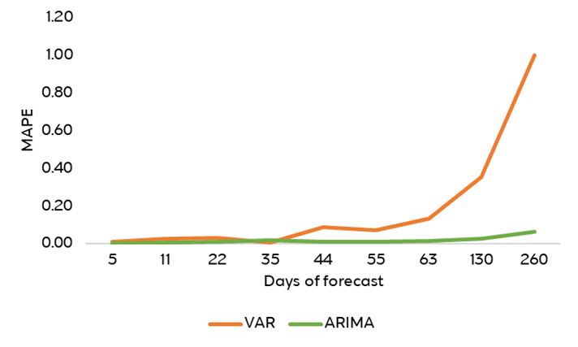

# Forecasting exchange rate
## Description
* The file contains a VAR and an ARIMA model to forecast the EUR/USD exchange rate
* **Data:** For the purpose of the project, daily data on EUR/USD, 10yr EU Bund yields, 10yr UST yields, oil prices (WTI), and gold prices (XAU) for the period Jan 4, 2000 – Sep 11, 2023 are sourced by Reuters Refinitiv.
All data are stationary after taking first differences, according to the ADF test.
* **Model:** At first, a VAR(p) model is fitted with the variables mentioned above. The order p is defined using the minimum AIC For $0 <= p <= 10$.
Nine different forecast windows are considered: 5, 11, 22, 35, 44, 55, 63, 130 and 260 days. The last $f$ observations of each sample are tested, (where  $f$ is the number of days of forecast) after training the first $n-f$ (where $n$ is the total number of days) observations.
The results are compared with a fitted random walk process (ARIMA (0,1,0)) with the orders $p=0$ and $q=0$ defined after observing the autocorrelation and partial autocorrelation (ACF and PACF) functions and $d=1$ because stationarity holds at first differences.
For each window, the forecasting accuracy is determined by the Mean Absolute Percentage Error (MAPE) criterion:
$$MAPE = \frac{1}{f} \sum^n_{t=1} \frac{|x_t - \hat{x}_t|}{x_t}$$
where $x_t$ is the actual value of EUR/USD, $\hat{x}_t$ is the forecast at time $t$ and $f$ is the number of days of forecast.

* **Results**: Figure 1 presents daily forecasts of EUR/USD under the VAR and ARIMA for each forecast window, compared with the actual value. Table 1 and Table 2 present the mean value of forecasts and the MAPE criterion for each forecast window under the VAR and ARIMA model respectively.
According to the results, the optimal performance of VAR is for a forecast window of 35 days, with MAPE showing a discrepancy between the actual and the projected value by 0.8%.
This is also the only forecast window were MAPE for mean forecasts is smaller in the case of VAR compared to the ARIMA forecasts (Figure 2), indicating that overall the random walk process performs better in most cases.

**Figure 1: Daily forecasts of EUR/USD for each forecast window** 

**Table 1: Mean value of EUR/USD VAR forecasts and relevant MAPE tests**

| Days of forecast | EUR/USD | EUR/USD forecast with VAR | MAPE |
| --- | --- | --- | --- |
| 5 | 1.07186 | 1.059896 | 0.011157 |
| 11 | 1.078409 | 1.049221 | 0.027099 | 
| 22 | 	1.083495 | 	1.118707 | 	0.032624 |
| 35 | 1.089569 | 	1.098181 | 	0.007997 |
| 44 | 1.095098 | 	1.189629 | 	0.088318 |
| 55 | 1.094355 | 	1.016738 | 	0.071172 |
| 63 | 1.093663 | 	0.947646 | 	0.133661 | 
| 130 | 1.088331 | 	0.70005	| 0.355931 | 
| 260 | 1.059955 | 	-0.02289 |	1.002797 | 

**Table 2: Mean value of EUR/USD ARIMA forecasts and relevant MAPE tests**

| Days of forecast | EUR/USD | EUR/USD forecast with ARIMA | MAPE |
| --- | --- | --- | --- |
| 5 | 1.07186 | 1.077324 | 0.005101 | 
| 11 | 1.078409 | 1.080952 | 0.006103 |
| 22 | 1.083495 | 1.097431	| 0.012964 |
| 35 | 1.089569 | 1.112552	| 0.021189 |
| 44 | 1.095098	| 1.100168	| 0.011798 |
| 55 | 1.094355	| 1.095913	| 0.00974 |
| 63 | 1.093663	| 1.074943	| 0.01747 |
| 130 | 1.088331 | 1.05993	| 0.026128 |
| 260 | 1.059955 | 0.993243	| 0.064704 |

**Figure 2: MAPE criterion for mean forecasts using VAR and ARIMA**

